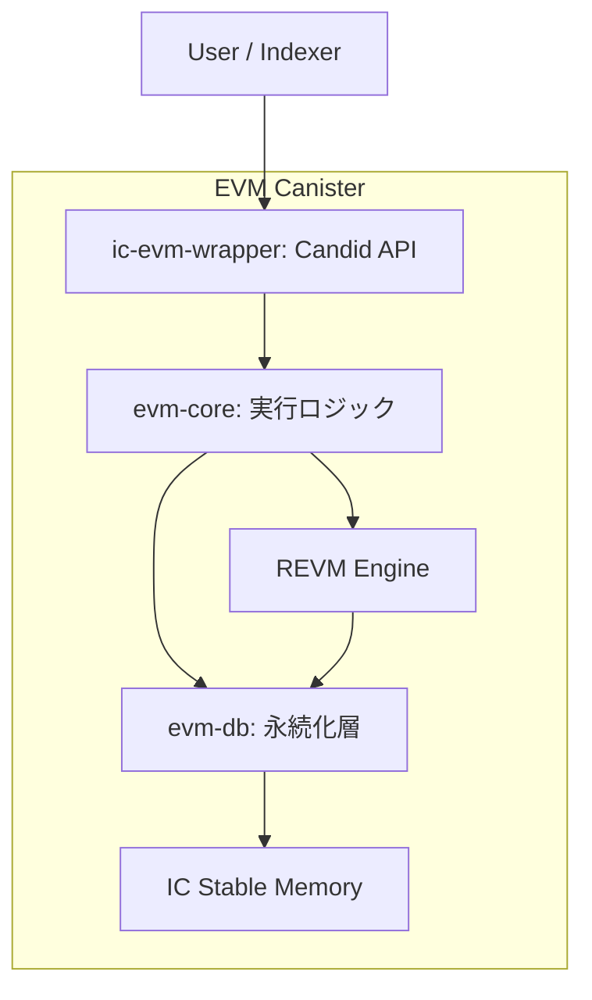

# IC-OP Whitepaper（Investor Edition）

最終更新: 2026-02-03

---

## このREADMEの目的

この文書は、IC-OP（Internet Computer上のEVM互換実行レイヤー）を**短時間で把握するための投資家向け要約**です。  
技術詳細よりも「何が価値で、どこがリスクか」を先に理解できる構成にしています。

---

## 30秒サマリ（先にここだけ読めばOK）

- IC-OPは、**EVM互換**と**Canisterネイティブ運用**を両立する実行基盤です。
- ねらいは、開発速度だけでなく、**長期運用の安定性（履歴管理・復旧・監査性）**まで担保することです。
- 技術的な中核は、`REVM` + `Stable Memory` + `安全なエクスポート/プルーニング` です。
- 収益は、手数料・運用付加価値・データ提供の3系統を想定しています。
- 主な検証ポイントは、アップグレード整合性・プルーニング回復性・Indexer再同期耐性です。

---

## 重要: インストール運用ルール（必読）

- `ic-evm-wrapper` の install 時は `InitArgs` が必須です（`Some(InitArgs)` を必ず渡す）。
- 空引数 install（`()` / `null` / `opt none` / 引数省略）はサポートしません。
- 推奨: `scripts/lib_init_args.sh` の `build_init_args_for_current_identity` を使って `--argument` を生成してください。
- `rpc_compat_e2e` 実行前は `scripts/run_rpc_compat_e2e.sh` を使い、最新wasmを再ビルドしてから検証してください。

---

## 0. 免責事項

本書は、IC-OPの技術・事業計画の説明資料です。  
法的・税務・投資助言を提供するものではありません。将来見通しには不確実性が含まれます。

---

## 1. 何を解決するのか（Why Now）

### 1.1 市場課題

- EVMアプリ需要は継続しているが、実運用でノード管理やデータ保守が重い
- 履歴肥大化で、保存コストと同期コストが長期的に増える
- スケーリング手段が多く、運用設計の複雑化が導入障壁になる
- ICPの非同期コール特性により、EVM DeFiの同期的atomic composabilityをそのまま再現しにくい

### 1.2 技術機会

- Canister/Stable Memoryを前提に、状態管理と運用の設計を作り直せる
- 永続化・エクスポート・プルーニングを一体設計し、運用予見性を上げられる

---

## 2. プロダクト仮説（何が強みか）

IC-OPは、次の3つを同時に提供します。

1. **EVM実行互換**（REVMベース）
2. **状態のオンチェーン永続化**（Stable Memory中心）
3. **長期運用性**（プルーニング + エクスポートAPI）

要するに、IC-OPは「早く作れる」だけでなく、**長く壊れにくく運用しやすい**EVM基盤を狙っています。

---

## 3. 技術アーキテクチャ（要約）

### 3.1 レイヤー

- `ic-evm-wrapper`: 外部公開API（Candid）
- `evm-core`: トランザクション処理、順序付け、ブロック生成
- `evm-db`: Stable Memory上の状態・履歴保存、プルーニング

### 3.2 技術モート（差別化）

- **決定論的順序付け**: 手数料 + 到着順で一貫処理
- **アップグレード配慮**: pre/post upgradeフック前提
- **履歴肥大化対策**: `Quarantine -> Free` の2段階削除
- **外部連携安全性**: 読み取り専用カーソルAPIで同期

---

## 4. IC Synthetic（中核機能）

IC Syntheticは、**ICPユーザーをEVM側でも同一人物として安全に扱う仕組み**です。  
`submit_ic_tx`（キュー投入）と `execute_ic_tx`（即時実行）の2モードがあります。

1. **なりすまし防止**: Principalから送信者アドレスを決定論的に生成
2. **取引フォーマット固定**: 送信先・金額・nonce等の解釈ズレを防止
3. **一意な取引ID**: 呼び出し元文脈を含め、追跡・監査を容易化
4. **nonce整合性**: 古い取引や飛び番を拒否し、順序事故を抑制
5. **実務価値**: 「誰が・何を・どの順で実行したか」を説明可能にする

---

## 5. 顧客とユースケース

### 5.1 主な顧客

- EVM互換アプリを短期間で提供したい開発チーム
- インフラ運用コストを下げたいプロトコル運営者
- 分析・可視化基盤を持つインデクサー事業者

### 5.2 主なユースケース

- DeFi・決済の高頻度トランザクション処理
- ゲーム/NFTの高速状態更新
- 監査可能性が必要な業務系スマートコントラクト
- ICP dAppのEVMバックエンド（Canister間連携）
- AI Agent/データAPI向け従量課金エンドポイント

### 5.3 ICP dApp連携方針

- **Canister-to-Canister連携**: `submit_ic_tx` / `execute_ic_tx` を直接呼び出し
- **主体継承**: `msg_caller`（Principal）をIC SyntheticでEVM送信者へ写像
- **責務分離**: UI/業務はdApp、資産実行と状態遷移はIC-OP
- **監査容易性**: Principal文脈を含む`tx_id`で追跡しやすい

### 5.4 x402との統合方針

- **入口分離**: 402決済フローはAPIゲートウェイ層で処理
- **課金整合**: `execute_ic_tx` を「1リクエスト=1実行」で扱いやすい
- **変更局所化**: 決済は外部レイヤー、IC-OPはEVM実行に集中
- **拡張性**: ネットワーク/資産選択をx402側で抽象化

---

## 6. 収益モデル（現時点）

1. **トランザクション関連収益**（Base Fee + Priority Fee）
2. **運用付加価値収益**（SLA、監視、サポート等）
3. **データ関連収益**（Indexer/分析向け、将来）

注: トークン発行・配分・解禁スケジュールは未確定です。確定後に別紙で開示します。

---

## 7. GTM（市場投入）

- **フェーズA（開発者獲得）**: SDK/サンプル/移行ガイド整備
- **フェーズB（事例拡大）**: Indexer連携テンプレート、DeFi/ゲーム案件形成
- **フェーズC（収益最適化）**: 有償運用プラン化、導入チャネル拡大

---

## 8. ロードマップ（技術 × 事業）

### 短期（0-6か月）

- tx処理・ブロック生成・export APIの安定化
- ローカル/ステージング向けRunbook整備
- 障害シナリオ（アップグレード/プルーニング中断）の検証強化

### 中期（6-12か月）

- Indexer運用の自動化、監視指標整備
- 高頻度ユースケース向け性能改善
- 外部監査・セキュリティテスト実施

### 長期（12か月以降）

- 商用運用前提のSLA設計
- パートナー連携拡大
- ガバナンス/トークン設計（必要時）を段階公開

---

## 9. KPI（投資家モニタリング）

### 成長KPI

- 月間アクティブウォレット（MAW）
- 1日あたりトランザクション数（実利用件数）
- 継続利用dApp数

### 収益KPI

- 手数料総額（Gross）
- 原価控除後純収益（Net）
- CAC回収期間（Payback）

### 品質KPI

- ブロック生成成功率
- APIエクスポート成功率
- 障害復旧時間（MTTR）

---

## 10. 主要リスクと対策

1. **実装バグ・障害**: テスト強化、段階リリース、障害Runbook
2. **需要不確実性**: DeFi/ゲーム等の優先セグメントでPMF検証
3. **規制・会計リスク**: 法務/税務アドバイザーと地域別方針を分離
4. **競争激化**: 運用簡潔性と長期データ管理品質で差別化

---

## 11. 技術仕様サマリ（ドラフト反映）

- World State（Account/Storage/Code）と履歴をStable Memory保存
- `ReadyKey`で決定論的Tx順序付け（Fee優先 + 到着順）
- `TxLoc`で `Queued / Included / Dropped` を追跡
- `export_blocks(cursor, max_bytes)` で安全に分割取得
- プルーニングは `retain_days / retain_blocks / target_bytes` の複合条件
- 削除は `Quarantine -> Free` の2段階 + ジャーナル回復

---

## 12. DD（技術デューデリ）確認ポイント

- メモリレイアウト互換性（アップグレード時）
- プルーニング中断時の回復整合性
- Indexer再同期時のデータ欠損耐性
- テストカバレッジ（単体・統合・E2E）の継続更新状況

---

## 13. Closing

IC-OPは、EVM互換性そのものよりも、**運用継続性を中核価値に置いた実行基盤**です。  
導入初期の速度と、長期運用の安定性を同時に取りにいく設計を採用しています。
